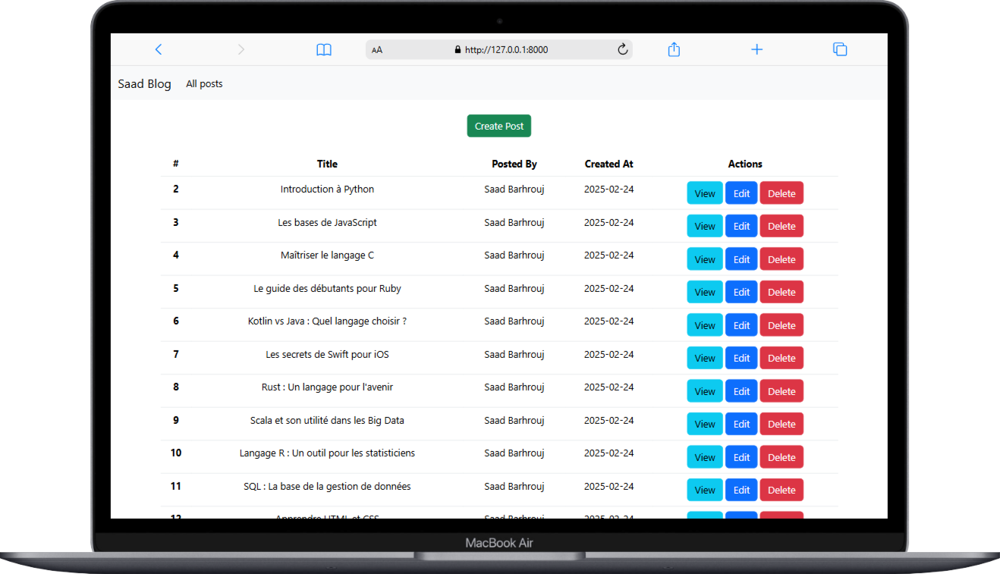

# Laravel Basic Blog CRUD


<div style="text-align: center;">
    
   
</div>

<hr>

🚀 **Laravel Basic Blog CRUD** est une application simple construite avec **Laravel** et **Bootstrap**. Ce projet est conçu pour vous aider à comprendre et mettre en œuvre les opérations CRUD (Create, Read, Update, Delete) dans un projet Laravel.

## 🌟 Fonctionnalités
- **Créer des articles** 📝
- **Afficher les articles** 👀
- **Modifier des articles** ✏️
- **Supprimer des articles** 🗑️
- Interface utilisateur simple et réactive avec **Bootstrap**

## 📂 Structure des Routes
Voici les routes principales de l'application :
- `/posts` : Liste tous les articles.
- `/posts/create` : Page pour créer un nouvel article.
- `/posts/{post}/edit` : Page pour modifier un article existant.
- `/posts/{post}` : Affiche un article spécifique.
- `/posts` (POST) : Stocke un nouvel article.
- `/posts/{post}` (PUT) : Met à jour un article.
- `/posts/{post}` (DELETE) : Supprime un article.

## 🛠️ Technologies utilisées
- **Laravel** : Framework PHP backend.
- **Bootstrap** : Framework CSS pour une interface utilisateur réactive.
- **PHP** : Langage backend principal.
- **MySQL** : Base de données pour stocker les articles.

## 📦 Installation
1. Clonez ce dépôt :
   ```bash
   git clone https://github.com/votre-utilisateur/Laravel-Basic-Blog-CRUD.git
   cd Laravel-Basic-Blog-CRUD
   ```

2. Installez les dépendances avec Composer :
   ```bash
   composer install
   ```
3. Configurez votre fichier `.env` :
   - Créez une base de données.
   - Mettez à jour les informations de connexion dans le fichier `.env`.

4. Exécutez les migrations pour créer les tables :
   ```bash
   php artisan migrate
   ```

5. Démarrez le serveur local :
   ```bash
   php artisan serve
   ```

6. Accédez à l'application dans votre navigateur à l'adresse :
   ```
   http://127.0.0.1:8000
   ```

## Contact

Pour toute question ou assistance, contactez-nous :  

- **Email:** [Saad Barhrouj](saad.barhrouj@etu.uae.ac.ma) 📧
- **LinkedIn:** [Saad Barhrouj](https://www.linkedin.com/in/saad-barhrouj-b37270295/) 💼
- **GitHub:** [SaadBarhrouj](https://github.com/SaadBarhrouj) 🐙
- **Mon Portfolio :** [Live Portfolio](https://portfolio-saad-barhrouj.netlify.app/) 
